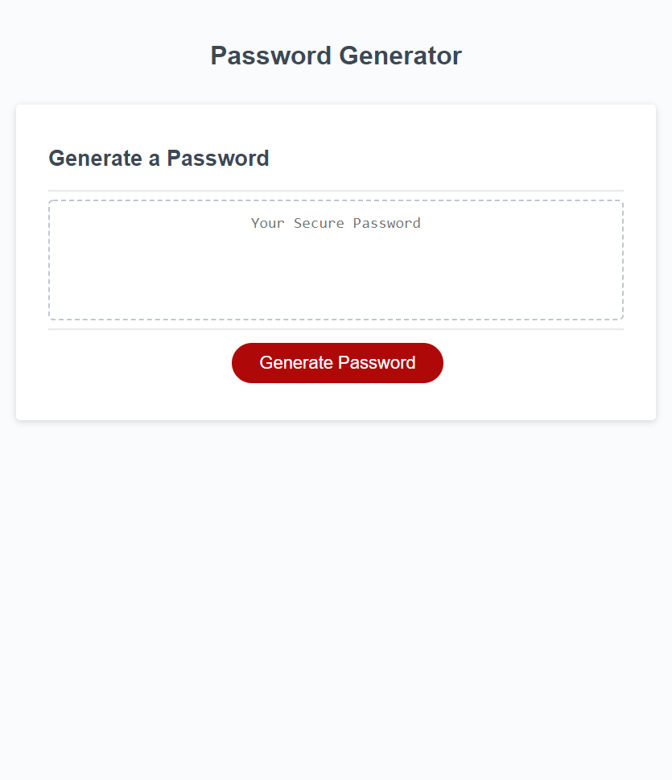

# Password-generator

### Description:
This code is used to generate a competely random password. This program has the ability to specify if you want number, special characters, uppercase letters and lowercase letters. The user is also able to choose how many character are in the password between 8 and 128.

### Technology used:
1\. Javacript  
2\. HTML  
3\. CSS

## Links:

[Link to Github Repo](https://github.com/Lekashi/password-generator "Link to Github Repo")

[Link to Website](https://lekashi.github.io/password-generator/ "Link to Website")

## Screenshot of the website

